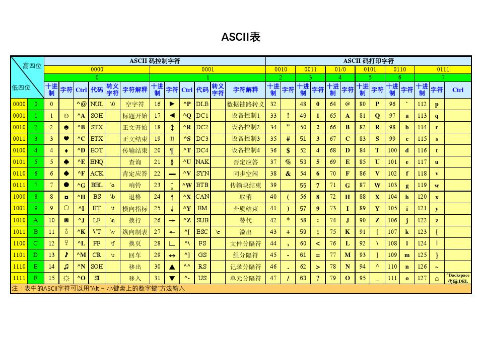

#### 进制表示

```javascript
let a = 0b10100; // 二进制用0b表示 20
console.log(a);
let b = 0o24; // 8进制0o表示 20
console.log(b);
let c = 24; // 10进制表示 20
console.log(c);
let d = 0x14; // 16进制0x表示 20
console.log(d);
// NOTE 将任意进制转为10进制，parseInt的第一个参数为字符串
console.log(parseInt("0x10", 16)); // 将16进制的'0x10'字符串转为10进制得16
// NOTE 将10进制转为任意进制
console.log((20).toString(16)); // 将十进制的20转为16进制得'14'字符
```

#### 编码格式

##### ASCII 码

> 美国人发明的编码格式，用一个 8 位字节表示，能够表示 256(11111111 -> 2^7+2^6+2^5+2^4+2^3+2^2+2^4+2^0+ -> 2^8-1)个状态，ASCII 只使用了 127 位

在 ASCII 中，**0-32**中状态规定了**特殊用途**，如：`0x10(->16)`表示终端换行，又把所有的空格，标点符号，数字，大小写字母分别用连学的自解状态表示，一直用到了**127 位**，这样这**128(0-127 包含 32 个不能打印出来的控制符号)**，只占用了一个字节的后面 7 位(01111111 -> 127)，前面统一规定为 0；ASCII 表如下：

后来一些其他西欧国家用的不是英文，所以他们就直接用了 127 号之后的空位来保存他们新的字母，一直保存到 255，所以 128-255 这一页的字符集被称为扩展字符集

##### G(国)B(标)2312

> 中国为了表示汉字，把 127 号之后的符号取消了，使用了俩个字节来表示汉字。GB2312 是对 ASCII 编码的中文扩展，可以组合出 7000 多个**简体**汉字,其中有一部分未使用
> 其中规定：

- 一个小于 127 的字符的意义与原来的相同，但两个大于 127 的字符连在一起，就表示一个汉字；
- 前面一个称之为高字节(247-161)(**大于 127**)，后面一个成为低字节(254-161)(**大于 127**)；
- 还把数字符号，日文假名和 ASCII 里原来就有的数字、标点和字母都重新编程俩个字长的编码，这就是全角字符，127 以下的那些就叫做半角字符；

##### G(国)B(标)K(扩展)

> 后来还是不够用，干脆就等于低位不做**大于 127**的限制，只要一个字节是大于 127 就认为是一个汉字的开始。这样就又增加了近 20000 个字符，包含繁体字和符号，就成为了 GBK 编码

##### G(国)B(标)18030 / DBCS

> 增加了几千个新的少数民族的字，GBK 扩展成为了 GB18030,通称 DBCS

##### Unicode(简称 UCS，俗称为 Unicode)

> ISO 的国际组织定制的一个包括了地球上所有文化、所有字母和符号的编码。Unicode 是一个很大集合，现在的规模可以容纳 100 多万个符号。
> 直接使用俩个字节，也就是 16 位来统一表示所有字符，对于 ASCII 里的那些半角字符，Unicode 保持其原编码不变，只会将其长度由原来的 8 位扩展为 16 位，而其他文化和语言则全部统一编码。
> 从 Unicode 开始，无论是半角的英文字母还是全角的汉字，他们都是统一的一个字符。也是统一的俩个字节。

- 字节是 8 位的物理存储单元。
- 字符则是一个文化相关的符号。

##### UTF-8

> 但 Unicode 在很长一段时间都是无法推广，直到互联网的出现，为解决 Unicode 如何在网络上传输存储的问题，于是面向传输的众多 UTF 标准出现了，UTF-8 就是使用最广的一种 Unicode 实现和存储方式之一。

- UTF-8 每次都是以 8 个位为单位传输数据
- UTF-16 就是每次以 16 个位传输
- UTF-8 最大的一个特点就是他是一种变长的编码方式，在表示英文字符(1 个字节)和中文字符(3 个字节)时，所占用的字节数是不一样的。
- Unicode 是一个中文字符占 2 个字节，而 UTF-8 一个中文字符占 3 个字节
- 编码规则：
  1. 对于单字节的符号，第一位设为 0，后面 7 位表示这个符号的 Unicode，因为对于英文字母，UTF-8 和 ASCII 码是相同的。吧

###### 联通不如移动

在中文的 windows 的记事本当中，默认采用的是本地编码`ANSI(GB2312/GBK)`编码，而输入`联通`时，记事本会将在解析`联通`二进制码时，错误的将其判定为`UTF-8`编码格式。导致再次打开时为乱码。
**原因**：

1. 联：

C1 1100 0001

AA 1010 1010 2. 通：

CD 1100 1101

AB 1010 1000

这俩个字在 GB2312 中的二进制码与 UTF-8 所保留的 110*，10*一致，导致记事本错误的猜测应该采用 UTF-8 编码，所以导致错误！

#### base64

> base64 的编码是将二进制编码为字符串，与其他编码方法将二进制转为字符串相反；

> base64 是为了解决非纯英文在传输时出现的乱码情况。如中文或其他文字传输， 还有非文字类的，如图片等二进制传输；

##### 编码：

base64 在编码时，是根据`['A', 'B', 'C', ... 'a', 'b', 'c', ... '0', '1', ... '+', '/']`来进行匹配，具体步骤为：

1. 将待转换的字符或者二进制分为每`3字节`一组，一共`3 * 8 = 24`位，然后将每 6 位组合一起，分为 4 组，`4 * 6 = 24`位；**之所以要每 6 位组合，是因为 6 位二进制`111111`转为十进制就是 63，那么从 0-63 也就刚好够进行匹配；**；
2. 将每组 6 位前面添加 2 个 0，组成 4 个 8 位，也就是 4 个字节，所以**3 个字节变成了 4 个字节，base64 编码方式就会比让原来字符所占的二进制大三分之一左右**；
3. 再根据每个组合二进制算出来的十进制数去匹配，最后组合在一起，


- 第一步：“M”、“a”、"n"对应的 ASCII 码值分别为 77，97，110，对应的二进制值是 01001101、01100001、01101110。如图第二三行所示，由此组成一个 24 位的二进制字符串。
- 第二步：如图红色框，将 24 位每 6 位二进制位一组分成四组。
- 第三步：在上面每一组前面补两个 0，扩展成 32 个二进制位，此时变为四个字节：00010011、00010110、00000101、00101110。分别对应的值（Base64 编码索引）为：19、22、5、46。
- 第四步：用上面的值在 Base64 编码表中进行查找，分别对应：T、W、F、u。因此“Man”Base64 编码之后就变为：TWFu。

##### 注意事项

- base64 在将每 3 个字节分组时。如果不足以组成 3 个字节，那么如下处理：
   1. 两个字节：两个字节共 16 个二进制位，依旧按照规则进行分组。此时总共 16 个二进制位，每 6 个一组，则第三组缺少 2 位，用 0 补齐，得到三个 Base64 编码，第四组完全没有数据则用“=”补上。因此，上图中“BC”转换之后为“QKM=”； 2. 一个字节：一个字节共 8 个二进制位，依旧按照规则进行分组。此时共 8 个二进制位，每 6 个一组，则第二组缺少 4 位，用 0 补齐，得到两个 Base64 编码，而后面两组没有对应数据，都用“=”补上。因此，上图中“A”转换之后为“QQ==”；
- Base64 编码主要用在传输、存储、表示二进制领域，不能算得上加密，只是无法直接看到明文。也可以通过打乱 Base64 编码来进行加密。
- 中文有多种编码（比如：utf-8、gb2312、gbk 等），不同编码对应 Base64 编码结果都不一样。
- 上面我们已经看到了 Base64 就是用 6 位（2 的 6 次幂就是 64）表示字符，因此成为 Base64。同理，Base32 就是用 5 位，Base16 就是用 4 位。
